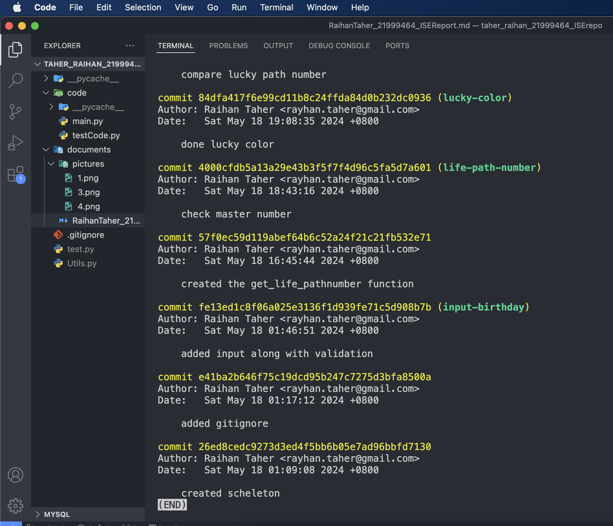

# Assessment: Introduction to Software Engineering– ISAD1000/5004 2024 Semester 1
**Student Name**: Raihan Taher  
**Student ID**: 21999464 
**Practical Class**: Wednesday  


# Intruduction 

This Python codebase is designed to findout life path numbers, lucky colors of people based on their birthdate using object-oriented programming. It includes functionality for parsing different birthday formats, determining generation, and validating user input. We can also findout if two person are from same life path number and whether that number is master number or not.

We applied modularity concept along with object-oriented programming to reduce coupling and to improve cohesiveness of the program. Here I also applied blackbox testing and whitebox testing depending which one is more appropriate for that module. 


# Module Description 

First I thought about having a Class (Person) for the person we are working on, in that we will have properties and method for determining life path  number, lucky color and generation. Then the other functions we might need for implementation will be declared globally. This way we will have one sub module for one well defined task which is the ultimate goal we want to achieve in modularity. 

Person Class
This class represents a person with attributes such as name, birthday, generation, and life path number. It includes methods to determine a person's generation, calculate their life path number, and identify their lucky color based on their life path number.

Attributes:

- name: The name of the person.
- birthday: The birthday of the person in DDMMYYYY format.
- generation: The generation of the person based on their birth year.
- life_path_num: The life path number calculated from the birthday.

Methods:

- \__init__(self, name, birthday): Initializes the person with a name and birthday, and computes the generation and life path number.
- get_lucky_color(self): Returns the lucky color based on the life path number.
- get_life_path_number(self): Calculates and returns the life path number.
- get_generation(self): Determines and returns the generation based on the birth year.

### Design Decisions and Assumptions
##### Design Decisions:

Modularity and Separation of Concerns:

The design separates the main functionalities in Person class. This adheres to the principle of separation of concerns, where Person handles the attributes and behaviors of an individual, and global modules provides utility functions to support these behaviors.

By separating these concerns, the code is more maintainable, easier to understand, and allows for independent testing of each class.

##### Assumptions:

- The birthday input is assumed to be either in DD-MM-YYYY or DD Month YYYY format. This is handled by the get_valid_birthday_input method, which converts the input to a consistent DDMMYYYY format.
- I assumed the property name for the Person class and passed it as hard coded peremeter in the constructor. 

# Modularity
While implementing the initial design using modularity concept I got better ideas of imprvoing mentainability and readability of the code. 

- I moved my global methods to Helper class which opened rooms for future improvement, easier to understand and allows for independent testing of each class.

- I used static methods in the Helper class because these methods do not rely on instance-specific data. They perform general tasks that can be utilized without needing an instance of the class, making them suitable for utility functions.

- For unit testing I made two seperate class as well. TestPerson and TestHelper for the respected classes.  

Now the final design separates the functionalities into two classes: Person and Helper. This adheres to the principle of separation of concerns, where Person handles the attributes and behaviors of an individual, and Helper provides utility functions to support these behaviors. 

## Modularity Concepts Applied in the Code

### Separation of Concerns

- **Person Class**: Manages attributes and behaviors related to an individual, such as:
  - Name
  - Birthday
  - Generation
  - Life path number
- **Helper Class**: Provides utility functions that support the Person class, including:
  - Summing digits
  - Checking master numbers
  - Comparing life path numbers
  - Validating input

### Encapsulation

- **Person Class**: Encapsulates the logic for determining generation and life path number. Users of the class only need to know how to use the methods, not the implementation details.
- 
- **Helper Class**: Encapsulates utility functions, allowing them to be reused without exposing their internal logic to the rest of the program.

### Reusability

- The static methods in the Helper class are designed to be reusable across different parts of the application without modification.
  
- Methods in the Person class are designed to handle specific tasks related to the individual's data, making them reusable for any Person object.

### Single Responsibility Principle (SRP)

- Each class and method has a single responsibility. For example:
  - `get_lucky_color` is responsible solely for determining the lucky color based on the life path number.
  - `get_generation` solely determines the generation based on the birth year.

## Review Checklist

#### Code Clarity

1. Are the class and method names descriptive?
2. Is there any redundant code?

#### Functionality

1. Do methods perform their intended function correctly?
2. Are edge cases handled properly?

#### Modularity

1. Are the responsibilities of the classes and methods well-defined and separated?
2. Is the code organized into logical sections or modules?

#### Reusability

1. Are utility functions designed to be reusable?
2. Is there any duplicated code that could be refactored into reusable functions?

#### Test Coverage

1. Are there unit tests for all major functions and edge cases?
2. Do tests cover both typical and atypical usage scenarios?

#### Error Handling

1. Are potential errors and exceptions handled gracefully?
2. Is input validation performed to prevent invalid data?

## Review Results and Refactoring Decisions

### Review Checklist Results

#### Code Clarity

- The class and method names are descriptive and clear.
- There is no redundant code that is worth mentioning

#### Functionality

- Methods perform their functions correctly.
- Edge cases are generally well-handled, particularly in the input validation method.

#### Modularity

- Responsibilities are well-defined and separated between Person and Helper classes.
- The code is logically organized, making it easy to understand and maintain.

#### Reusability

- Utility functions in the Helper class are designed to be reusable.
- There are no significant instances of duplicated code.

#### Test Coverage

- Unit tests cover the major functionalities and edge cases effectively.
- Additional edge case tests, such as unusual but valid dates, would enhance coverage.


## Refactoring Decisions

### Enhance Input Validation
- Add more validation in the Person class constructor to ensure the birthday is in the correct format before proceeding with calculations.


#### Refactor global Methods
Add them in a new class as static method. Example:

##### Before:

```python
    def sum_digits(num):
        total = 0
        while num > 0:
            digit = num%10
            total = total + digit
            num = num//10
        return total

    def is_master_number(num):
        master_number = [11,22,33]
        return num in master_number

    def lifePathCompare(person1, person2):
        return person1.life_path_num == person2.life_path_num
```
 ##### After

```python
class Helper:
    @staticmethod
    def sum_digits(num):
        total = 0
        while num > 0:
            digit = num%10
            total = total + digit
            num = num//10
        return total

    @staticmethod
    def is_master_number(num):
        master_number = [11,22,33]
        return num in master_number

    @staticmethod
    def lifePathCompare(person1, person2):
        return person1.life_path_num == person2.life_path_num

```
#### Refactor parse_birthday() and get_valid_birthday_input() functions:
These two modules had strong coupling which made it very difficult to design test code for them. To eliminate coupling I merged them. Example:

##### Before
````python

def parse_birthday(birthday):
    try:
        return datetime.strptime(birthday, "%d-%m-%Y").strftime("%d%m%Y")
    except ValueError:
        try:
            return datetime.strptime(birthday, "%d %B %Y").strftime("%d%m%Y")
        except ValueError:
            return False

def get_valid_birthday_input():
    while True:
        birthdate = input("Enter birthday (DD-MM-YYYY or DD Month YYYY): ")
        birthdate = parse_birthday(birthdate)
        if birthdate:
            return birthdate
        else:
            print("Invalid birthday format. Please use either DD-MM-YYYY or DD Month YYYY.")
````
##### After
````python
    @staticmethod
    def get_valid_birthday_input():
        while True:
            birthdate = input("Enter birthday (DD-MM-YYYY or DD Month YYYY): ")
            try:
                formatted_date = datetime.strptime(birthdate, "%d-%m-%Y").strftime("%d%m%Y")
                return formatted_date
            except ValueError:
                try:
                    formatted_date = datetime.strptime(birthdate, "%d %B %Y").strftime("%d%m%Y")
                    return formatted_date
                except ValueError:
                    print("Invalid birthday format. Please use either DD-MM-YYYY or DD Month YYYY.\n")
````

### Refactor  life_path_compare method:
Refactored the method to do only one well defined job which is compare the life paths. printing is then handled by main() function. By doing so, it was much easier to design test code for this module.
##### Before
````python
    @staticmethod
    def lifePathCompare(person1, person2):
        print(f"{person1.name} life path number is {person1.life_path_num}\n{person2.name} life path number is {person2.life_path_num}")
        if(person1.life_path_num == person2.life_path_num):
            print("life path number is same")
        else:
            print("life path number is not same")
````
#### After
````python
    # in class Helper
    @staticmethod
    def lifePathCompare(person1, person2):
        return person1.life_path_num == person2.life_path_num

    #then in main()
    ....
    if(Helper.lifePathCompare(person,person2)):
        print("Their life path number is same")
    else:
        print("Their life path number is not same")

````
### Combine Common Logic in Helper Methods

- Ensure that any repeated logic in Helper methods is combined into a single method to avoid redundancy.

## Execute the Program
To run the program just execute the main.py file 
````` 
python3 ./code/main.py
`````

Then Enter a valid date with appropriate format (Please, Check the Screenshot)


# Black Box Testing

## Equivalence Partitioning Test Cases


We will apply equivalence partitioning to the following modules and methods:

1. `Person.get_life_path_number`
2. `Helper.sum_digits`
3. `Helper.is_master_number`
4. `Helper.lifePathCompare`
5. `Helper.get_valid_birthday_input`

Here is the detailed approach and the test cases for each method:

#### 1. `Person.get_life_path_number`

    Submodule: get_life_path_number
    Imports: self (object)
    Exports: result (int)
    This method calculates the life path number based on the birthday. We consider the birthday as an integer in `DDMMYYYY` format.


| Category                | Test Data      | Expected Result | 
|-------------            |----------------|-----------------|
| Not Master Number       | "01011901"     | 4               |
| Master Number           | "20041998"     | 33              |
| Minimum valid birthday. | "20012004"     | 9               |
| Maximum valid birthday  | "31122024"     | 6               |

#### 2. `Helper.sum_digits`

    Submodule: get_life_path_number
    Imports: num (int)
    Exports: result (int)
    This method calculates the sum of the digits of a given number.


| Category                | Test Data | Expected Result | 
|-------------            |-----------|-----------------|
| one digit number        | 5         | 5               |
| Multiple digit number   | 123       | 6               |
| Large number            | 987654321 | 45              |
| Zero                    | 0         | 0               |


#### 3. `Helper.is_master_number`

    Submodule: get_life_path_number
    Imports: num (int)
    Exports: result (boolean)
    This method checks if a number is a master number (11, 22, 33).

| Category                |    Test Data | Expected Result |
|-------------            |--------------|-----------------|
| Master Number           | 33           | True            |
| Not a Master Number     | 10           | False           |  
| Invalid Data type       | "Taher"     | False           |
| Invalid Input           | None         | False           |
| Invalid Data type       | [11]         | False           |

#### 4. `Helper.lifePathCompare`

    Submodule: lifePathCompare
    Imports: person1, person2 (objects)
    Exports: result (boolean)
    This method compares the life path numbers of two persons.


|      Category                       | Input      | Expected Result |
|-----------------------------------  |-------     |-----------------|
| Same life path number               | 5, 5       | True            |
| Different life path number          | 1, 9       | False           | 
| Invalid input (string)              | "9464", 5     | False           |
| Invalid input (None)                | None, 5    | False           | 

#### 5. `Helper.get_valid_birthday_input` (Mock input for testing)

    Submodule: get_valid_birthday_input
    Imports:
    Exports: birthday(string)
    This method prompts the user for a birthday and validates the input format.
    

| Category                                        | Test Data                               | Expected Output  | 
|-------------------------------------------------|-----------------------------------------|------------------|
| Valid input (DD-MM-YYYY)                        | "01-01-2000\n"                          | "01012000"       | 
| Valid input (DD Month YYYY)                     | "15 June 1995\n"                        | "15061995"       |
| Multiple invalid inputs then by input           | "TAHER 9464\n22 Feb 2022\n05 May 2023\n"   | "05052023"       |

## Summary

Equivalence partitioning helps us ensure that all different input scenarios are covered with a minimal number of test cases. The above tables summarize how we can test each module effectively using this approach. These test cases should be implemented in our `unittest` framework to ensure comprehensive testing of the `Person` and `Helper` classes.


## Boundary Value Analysis

We will apply Boundary Value Analysis to the following module:

1. `Person.get_generation`

        Submodule: get_generation
        Imports: self (object)
        Exports: generation (string)
        This method calculates determines generation name based on the 
 year from birthday.


| Boundary                            | Test Data      | Expected Result       |
|--------------------------------     |----------------|-----------------------|
| Just below Silent Generation        | 1900           | "Unknown Generation"  |
| Lower boundary of Silent Generation | 1901           | "Silent Generation"   |
| Upper boundary of Silent Generation | 1945           | "Silent Generation"   |
| Lower boundary of Baby Boomers      | 1946           | "Baby Boomers"        |
| Upper boundary of Baby Boomers      | 1964           | "Baby Boomers"        |
| Lower boundary of Generation X      | 1965           | "Generation X"        |
| Upper boundary of Generation X      | 1979           | "Generation X"        |
| Lower boundary of Millennials       | 1980           | "Millennials"         |
| Upper boundary of Millennials       | 1994           | "Millennials"         |
| Lower boundary of Generation Z      | 1995           | "Generation Z"        |
| Upper boundary of Generation Z      | 2009           | "Generation Z"        |
| Lower boundary of Generation Alpha  | 2010           | "Generation Alpha"    |
| Upper boundary of Generation Alpha  | 2024           | "Generation Alpha"    |
| Just above Generation Alpha         | 2025           | "Unknown Generation"  |


# White Box Testing

These are the unit test modules we have here.

1. `TestPerson.test_life_path_number`
2. `TestPerson.test_get_generation`
3. `TestHelper.test_valid_birthday`
4. `TestHelper.test_sum_digits`
5. `TestHelper.test_is_master_number`
6. `TestHelper.test_life_path_compare`


#### 1.Test design for `TestPerson.test_life_path_number`


|      Path                       | Test Data      | Expected Result |
|-------------------------------  |-----------     |-----------------|
| Enter the If                    | 20041998       | 33              |
| Do not Enter the If             | 01012004       | 8               | 

> Note: Here we are assuming there will be no such case where this code doesn't enter the loop as we are validating the input from another module so its safe to make that assumption.


#### 2.Test design for `TestPerson.test_get_generation`


|      Path                         | Test Data      | Expected Result |
|-------------------------------    |-----------     |-----------------|
| Enter First If  (1901-1945)       | 23041901       |Silent Generation|
| Else If (1946 - 1964)             | 23041946       | Baby Boomers    | 
| Else If (1965 - 1979)             | 23041965       | Generation X    | 
| Else If (1980 - 1994)             | 23041980       | Millennials     | 
| Else If (1995 - 2009)             | 23041995       | Generation Z    | 
| Else If (2010 - 2024)             | 23042010       | Generation Alpha| 
| Else                              | 21999464       | Unknown         | <!-- Student ID -->

#### 3.Test design for `TestHelper.test_valid_birthday`


|      Path                  | Test Data      | Expected Result |
|----------------------------|-----------     |-----------------|
| Enter First try            | 20-04-1998     | 20041998        |
| Enter Second try           | 22 May 2005    | 22052005        | 
| Enter last except          | 24/05/24       | invalid Message - prompts again for input| 


#### 4.Test design for `TestPerson.test_sum_digits`


|      Path              | Test Data      | Expected Result |
|--------------------    |-----------     |-----------------|
| Enter the While        | 20041998       |33               |
| Do not enter the while | 5              | 5               | 


#### 5.Test design for `TestPerson.test_is_master_number`


|      Path              | Test Data      | Expected Result |
|--------------------    |-----------     |-----------------|
| Condition met          | 22             | True            |
| Doesn't meet condition | 5              | False           | 


#### 6.Test design for `TestPerson.test_life_path_compare`


|      Path              | Test Data      | Expected Result |
|--------------------    |-----------     |-----------------|
| is Equal               | 7,7            | True            |
| isn't Equal            | 5,11           | False           | 


Exaplanation: Here in all the test methods we did follow all possible paths our program could go as we are shown in our workshops.

# Test implementation and test execution

After opening the repository directory in the terminal  run
> python3 ./code/testCode.py

Example of running test modules with one failed case


Example of running all test modules successfully


As I mentioned in the refactoring section that perse_birthday() & input_validation() modules have been improved as it was much harder design test code for them with such strong coupling. 

# Summary

Here is the summary table for the things covered for the program

|             | Design  | of |test |cases | | Test code    | implementation|and execution|
|-------------|---------    |---        |---|--------------------------------------|---|---|---|---|
| Module name  | BB (EP)     | BB (BVA)     | WB |     Data type/s | Form of Input/output    | EP |         BVA     | White-Box |
| Person.get_lucky_color  | not done  | not done  | not done |   int   |    perameter        | not done    | not done  |        not done   |
| Person.get_life_path_number | done    | not done  | done      |  string     | file input     |  done           |  not done   | done  |   
| Person.get_generation | not done    |  done  | done      |  string     | perameter         |  not done           |  done   | done  |   
| Helper.sum_digits     |   done    | not done    | done   |  int     |    perameter               | done    | not done    |  done         |
| Helper.is_master_number  | done|  not done    | done     | int        |   perameter            | done    | not done     | done           |
| Helper.lifePathCompare| done| not done        | done    | object     |perameter             | done     | not done        | done          |
| Helper.get_valid_birthday_input  | done|not done|done| string | keyboard input            | done   | not done             |  done        |


# Version Control

## Git 
At the beginning, We were thinking about after doing initial setup in main branch, we'll do feature branch for all the distinct modules and then merge all of them in main branch. Ideally in software development its best practice to have a development branch and merge your feature branch there. Finally, when everything up and running fully tested, ready for release then it goes into main branch. But here as its a very simple program and I'm the only developer here so for simplicity we are not using the development branch for this program.

#### Branch used
    - main
    - input-birthday
    - life-path-compare
    - life-path-number
    - lucky-color
    - test-code

Their purpose is self explainatory, after each job is done and tested to will be merged in the main branch. Thats the initial plan, which might slightly change while developing.

Log of the use of Version Control:




# Discussion

## Achievements

### Code Implementation
- Developed the `Person` class with methods to calculate the life path number and determine the generation based on birth year.
- Implemented the `Helper` class with utility methods for summing digits, checking master numbers, and comparing life path numbers.
- Created a function to validate and format birthday inputs.

### Testing
- Designed test cases using Equivalence Partitioning and Boundary Value Analysis for the appropriate methods.
- Implemented unit tests for the `Person` and `Helper` classes covering various scenarios and edge cases.
- Verified the functionality and robustness of the code through extensive testing.

### Documentation
- Provided detailed explanations of the modularity concepts applied in the code.
- Created a markdown file to document everythhing we have done including test design and implementation facilitating clear understanding and review.

## Challenges Faced

### Handling Date Inputs
- Ensuring accurate parsing and validation of various date formats was challenging.
- Addressing potential user input errors required robust error handling.

### Test Case Design
- Designing comprehensive test cases that cover all possible input scenarios.
- Ensuring the tests accurately reflect real-world inputs and edge cases.


## Limitations

### Generation Ranges
- The generation ranges are hardcoded and might not cover future generations or changes in generational definitions.
- The "Unknown Generation" category might need more nuanced handling for future years beyond 2024.

### Date Handling
- The current implementation only supports specific date formats (`DD-MM-YYYY` and `DD Month YYYY`).
- There is no support for alternative date formats or localization.

### User Input
- The `get_valid_birthday_input` method relies on console input, which may not be ideal for all applications.

## Ways to Improve

### Dynamic Generation Handling
- Implement a more flexible approach to handle future generational ranges dynamically.
- Allow updates to the generation ranges without modifying the core logic.

### Enhanced Date Parsing
- Expand support for additional date formats and localization to cater to a wider user base.
- Implement more sophisticated date validation to handle edge cases and invalid dates gracefully.

### User Interface
- Develop a graphical user interface (GUI) or web-based interface to improve user experience.
- Provide clearer error messages and guidance for user inputs.

## Additional Information
- The project demonstrates the application of software engineering principles, including modularity, encapsulation, and thorough testing.
- The code is designed to be easily extensible, allowing for future enhancements and modifications.
- Detailed documentation and test cases ensure maintainability and ease of understanding for future developers.

By addressing the identified limitations and implementing the suggested improvements, the project can be further refined to provide a more robust and user-friendly experience.
